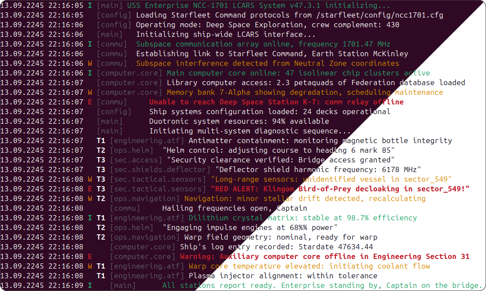

# Qt Logger

A simple yet powerful logging solution for the Qt Framework. This project is designed to provide developers with an intuitive and configurable logging system for Qt-based applications. QtLogger features a customizable pipeline for processing log messages through the `qInstallMessageHandler()` function, allowing for flexible handling and output of logs.



## Quick start

Just copy [qtlogger.h](https://github.com/yamixst/qtlogger/raw/refs/heads/main/qtlogger.h) to your project directory and use the global `gQtLogger` object for configuration:

```cpp
#include "qtlogger.h"

int main(int argc, char *argv[])
{
    QCoreApplication app(argc, argv);
    
    gQtLogger.configure();  // That's it!
    
    qDebug() << "It just works!";
    
    return app.exec();
}
```

## Key Features

- **Zero code changes** — works with existing `qDebug()`, `qInfo()`, `qWarning()`, `qCritical()`, `qFatal()`
- **One-line configuration**: `gQtLogger.configure()`
- **Console output** with optional colored output
- **Rotating logs** with size-based, daily, and startup rotation + gzip compression
- **Platform-native sinks**: Android logcat, macOS/iOS os_log, Linux syslog/systemd journal, Windows debugger
- **Network logging**: HTTP endpoints for remote logging
- **Category-based and regex filtering** for fine-grained control
- **Duplicate suppression** to prevent log spam
- **Pattern formatter** with rich placeholder support (time formats, fixed-width fields, conditional blocks)
- **JSON formatter** for structured logging and log aggregation
- **Chainable fluent API** for elegant configuration
- **Custom attributes** to enrich messages with metadata
- **Thread-safe** concurrent logging from multiple threads
- **Asynchronous logging** with optional dedicated thread for non-blocking I/O
- **Cross-platform**: Linux, Windows, macOS, iOS, Android — Qt 5.9 to Qt 6.x

## Integration

There are multiple ways to integrate QtLogger into your project:

### Option 1: Header-Only (Simplest)

Just copy [qtlogger.h](https://github.com/yamixst/qtlogger/raw/refs/heads/main/qtlogger.h) to your project and include it:

```cpp
#include "qtlogger.h"
```

This is the simplest approach - no build configuration needed.

### Option 2: CMake

Link against the QtLogger library in your `CMakeLists.txt`:

```cmake
# Add QtLogger subdirectory
add_subdirectory(path/to/qtlogger)

# Link your target
target_link_libraries(your_target PRIVATE qtlogger)
```

### Option 3: qmake

Include the QtLogger `.pri` file in your `.pro` file:

```qmake
# In your project's .pro file
include(path/to/qtlogger/qtlogger_link.pri)
```

## More examples

### Formatted logging with file rotation

This example demonstrates how to set up logging with human-readable colored output to the console (stderr) and automatic file rotation. The `configure()` method creates a rotating log file that compresses old logs when they exceed the specified size limit.

```cpp
#include "qtlogger.h"

int main(int argc, char *argv[])
{
    QCoreApplication app(argc, argv);
    
    gQtLogger.configure("app.log", 1024 * 1024, 5,
                        QtLogger::RotatingFileSink::Compression);
    
    qDebug() << "It just works!";
    
    return app.exec();
}
```

### Advanced configuration

For more complex scenarios, you can create multiple pipelines with different filters, formatters, and sinks. Each pipeline processes log messages independently, allowing you to route different types of logs to different destinations with specific formatting.

```cpp
#include "qtlogger.h"

int main(int argc, char *argv[])
{
    QCoreApplication app(argc, argv);

    // Configure with multiple pipelines
    gQtLogger
        .moveToOwnThread()                 // Asynchronous logging
        .addSeqNumber()
        .pipeline()
            .filterLevel(QtWarningMsg)     // Only warnings and above
            .filterDuplicate()
            .formatPretty()
            .sendToStdErr(true)            // Colored output
        .end()
        .pipeline()
            .format("%{time} [%{category}] %{type}: %{message}")
            .sendToFile("app.log", 1024 * 1024, 5,  // Rotating logs (1MB, 5 files)
                        QtLogger::RotatingFileSink::RotationOnStartup
                        | QtLogger::RotatingFileSink::RotationDaily
                        | QtLogger::RotatingFileSink::Compression)
        .end()
        .pipeline()
            .addAppInfo()
            .addHostInfo()
            .filter("^(?!.*password:).*$")  // Filter out sensitive data via Regex
            .formatToJson()
            .sendToHttp(QUrl("https://logs.example.com"))
        .end();

    // In advanced configuration mode, you must call this method explicitly
    gQtLogger.installMessageHandler();

    qDebug() << "Application started";
    qWarning() << "This is a warning";

    return app.exec();
}
```

### Configuration from file

You can configure the logger at runtime using an INI configuration file. This approach allows you to change logging behavior without recompiling your application.

```cpp
// Load configuration from INI file
gQtLogger.configureFromIniFile("config.ini");
```

Example `config.ini`:
```ini
[logger]
filter_rules = "*.debug=false"
message_pattern = "%{time} [%{category}] %{type}: %{message}"
stdout_color = true
path = "app.log"
max_file_size = 1048576
max_file_count = 5
rotate_on_startup = true
rotate_daily = false
compress_old_files = false
async = true
```

## Comparison with Other Libraries

| Feature | QtLogger | Log4Qt | QsLog | spdlog |
|---------|----------|--------|-------|--------|
| **Qt Integration** | Native (`qDebug()`, `qInfo()`, etc.) | Own API | Own API | Own API |
| **Header-only option** | ✅ | ❌ | ❌ | ✅ |
| **Zero code changes** | ✅ | ❌ | ❌ | ❌ |
| **Colored console output** | ✅ | ❌ | ✅ | ✅ |
| **File rotation** | ✅ (size/daily/startup) | ✅ (size) | ✅ (size) | ✅ (size/daily) |
| **Gzip compression** | ✅ | ❌ | ❌ | ❌ |
| **Async logging** | ✅ | ❌ | ✅ | ✅ |
| **JSON formatter** | ✅ | ❌ | ❌ | ✅ |
| **Pattern formatter** | ✅ | ✅ | ❌ | ✅ |
| **HTTP sink** | ✅ | ❌ | ❌ | ❌ |
| **Android logcat** | ✅ | ❌ | ❌ | ✅ |
| **macOS/iOS os_log** | ✅ | ❌ | ❌ | ❌ |
| **Linux syslog/journald** | ✅ | ✅ | ❌ | ✅ |
| **Duplicate suppression** | ✅ | ❌ | ❌ | ❌ |
| **Category filtering** | ✅ | ✅ | ❌ | ❌ |
| **Regex filtering** | ✅ | ❌ | ❌ | ❌ |
| **Fluent API** | ✅ | ❌ | ❌ | ❌ |
| **INI configuration** | ✅ | ✅ (XML) | ❌ | ❌ |
| **Qt dependency** | Required | Required | Required | None |
| **License** | MIT | Apache 2.0 | BSD/MIT | MIT |

## Requirements

- **C++17 compatible compiler**: QtLogger requires a compiler with full C++17 standard support
- **Qt Framework**: Qt 5.9 - Qt 6.x

## Documentation

- [**FEATURES.md**](doc/FEATURES.md) - Comprehensive list of all features and capabilities
- [**ARCHITECTURE.md**](doc/ARCHITECTURE.md) - Internal architecture and design patterns
- Examples in the [examples/](examples/) directory

## Versioning

This project adheres to **Semantic Versioning 2.0.0** (SemVer). 

Semantic Versioning is a versioning scheme that uses a three-part version number: `MAJOR.MINOR.PATCH`, where:

- **MAJOR** version changes introduce incompatible API changes.
- **MINOR** version changes add functionality in a backward-compatible manner.
- **PATCH** version changes include backward-compatible bug fixes.

For more details, refer to the [Semantic Versioning specification](https://semver.org/). 

By following SemVer, we aim to provide clear and predictable version updates for our users.

## License

This project is licensed under the MIT License. See the [LICENSE](./LICENSE) file for details.
