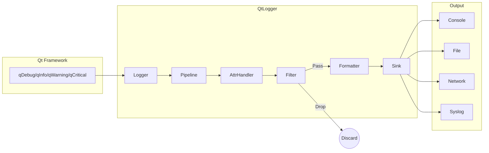
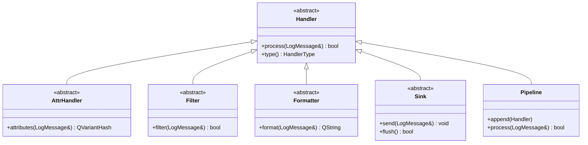
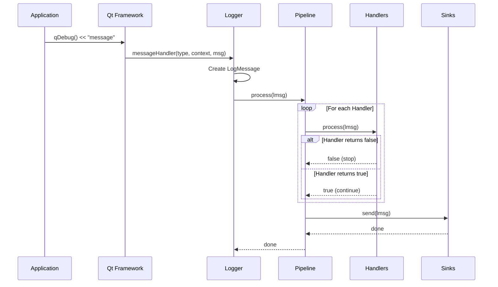

[QtLogger Docs](index.md) > Architecture

# Architecture

This document explains the internal architecture of QtLogger, how log messages flow through the system, and how different components interact.

---

## Table of Contents

- [Overview](#overview)
- [Data Flow](#data-flow)
- [Handler Types](#handler-types)
- [Pipeline Concept](#pipeline-concept)
- [Message Processing Flow](#message-processing-flow)
- [Lifecycle Management](#lifecycle-management)
- [Thread Model](#thread-model)

---

## Overview

QtLogger intercepts Qt's standard logging output through `qInstallMessageHandler()` and processes each log message through a configurable **pipeline** of **handlers**. This architecture allows for flexible message processing, filtering, formatting, and routing to multiple destinations.

The core design principles are:

1. **Composability** — Handlers can be combined in any order
2. **Separation of Concerns** — Each handler type has a specific responsibility
3. **Extensibility** — Easy to create custom handlers
4. **Thread Safety** — Safe concurrent logging from multiple threads

---

## Data Flow



When you call `qDebug() << "message"`:

1. Qt invokes the installed message handler
2. `Logger` creates a `LogMessage` object with all context
3. The message passes through the pipeline's handlers in order
4. Attribute handlers enrich the message with metadata
5. Filters decide whether to continue or discard
6. Formatters convert the message to a string
7. Sinks output the formatted message to destinations

---

## Handler Types

QtLogger uses a hierarchy of handler types, each with a specific role:



### Handler

The base class for all components. Every handler implements `process(LogMessage &lmsg)` which returns:
- `true` — Continue to the next handler
- `false` — Stop processing (message is dropped)

### AttrHandler

Adds custom attributes to the log message. Examples:
- [`SeqNumberAttr`](api/attributes.md#seqnumberattr) — Adds a sequential message number
- [`AppInfoAttrs`](api/attributes.md#appinfoattrs) — Adds application name, version, PID
- [`HostInfoAttrs`](api/attributes.md#hostinfoattrs) — Adds hostname and IP address

### Filter

Decides whether a message should continue through the pipeline:
- [`LevelFilter`](api/filters.md#levelfilter) — Filter by severity level
- [`CategoryFilter`](api/filters.md#categoryfilter) — Filter by logging category
- [`RegExpFilter`](api/filters.md#regexpfilter) — Filter by regex pattern
- [`DuplicateFilter`](api/filters.md#duplicatefilter) — Suppress repeated messages

### Formatter

Converts the `LogMessage` into a formatted string:
- [`PatternFormatter`](api/formatters.md#patternformatter) — Customizable pattern-based formatting
- [`JsonFormatter`](api/formatters.md#jsonformatter) — JSON output for structured logging
- [`PrettyFormatter`](api/formatters.md#prettyformatter) — Human-readable colored output
- [`QtLogMessageFormatter`](api/formatters.md#qtlogmessageformatter) — Uses Qt's default formatting

### Sink

Outputs the formatted message to a destination:
- [`StdOutSink`](api/sinks.md#stdoutsink) / [`StdErrSink`](api/sinks.md#stderrsink) — Console output
- [`FileSink`](api/sinks.md#filesink) / [`RotatingFileSink`](api/sinks.md#rotatingfilesink) — File output
- [`HttpSink`](api/sinks.md#httpsink) — HTTP endpoint
- [`SyslogSink`](api/sinks.md#syslogsink) / [`SdJournalSink`](api/sinks.md#sdjournalsink) — System logs

### Pipeline

A container that holds multiple handlers and processes them in sequence. Pipelines can be nested, allowing complex routing scenarios.

---

## Pipeline Concept

### Basic Pipeline

A pipeline is an ordered list of handlers:

```cpp
Pipeline pipeline;
pipeline << LevelFilterPtr::create(QtWarningMsg)
         << PatternFormatterPtr::create("%{time} %{message}")
         << StdErrSinkPtr::create();
```

Messages flow through handlers in order. If any handler returns `false`, processing stops.

### SortedPipeline

`SortedPipeline` automatically organizes handlers by type:

```
AttrHandlers → Filters → Formatters → Sinks → Pipelines
```

This ensures handlers are always processed in the correct order regardless of insertion order.

### SimplePipeline

`SimplePipeline` extends `SortedPipeline` with a fluent API:

```cpp
gQtLogger
    .addSeqNumber()           // AttrHandler
    .filterLevel(QtInfoMsg)   // Filter
    .formatPretty()           // Formatter
    .sendToStdErr();          // Sink
```

### Nested Pipelines

Pipelines can contain other pipelines for complex routing:

```cpp
gQtLogger
    .pipeline()                        // Sub-pipeline 1
        .filterLevel(QtWarningMsg)
        .formatPretty()
        .sendToStdErr(true)
    .end()
    .pipeline()                        // Sub-pipeline 2
        .formatToJson()
        .sendToFile("app.log")
    .end();
```

Each sub-pipeline processes messages independently. A message rejected by one sub-pipeline can still be processed by another.

---

## Message Processing Flow

### Detailed Flow Diagram



### Processing Rules

1. **Sequential Processing**: Handlers are called in order
2. **Early Termination**: If a handler returns `false`, remaining handlers are skipped
3. **Formatter Effect**: A formatter sets `lmsg.formattedMessage()` for subsequent sinks
4. **Independent Pipelines**: Nested pipelines are processed independently

### Example Processing

Given this configuration:

```cpp
gQtLogger
    .addSeqNumber()
    .filterLevel(QtWarningMsg)
    .format("%{seq_number} %{message}")
    .sendToStdErr();
```

For `qWarning() << "Test"`:

| Step | Handler | Action | Result |
|------|---------|--------|--------|
| 1 | SeqNumberAttr | Add `seq_number=1` | Continue |
| 2 | LevelFilter | Check level >= Warning | Continue |
| 3 | PatternFormatter | Format to `"1 Test"` | Continue |
| 4 | StdErrSink | Output to stderr | Continue |

For `qDebug() << "Test"`:

| Step | Handler | Action | Result |
|------|---------|--------|--------|
| 1 | SeqNumberAttr | Add `seq_number=2` | Continue |
| 2 | LevelFilter | Check level >= Warning | **Stop** (Debug < Warning) |

---

## Lifecycle Management

### Smart Pointers

All handlers use `QSharedPointer` for automatic memory management:

```cpp
using HandlerPtr = QSharedPointer<Handler>;
using FilterPtr = QSharedPointer<Filter>;
using SinkPtr = QSharedPointer<Sink>;
// ... etc
```

This ensures:
- Handlers are automatically deleted when no longer referenced
- Safe sharing of handlers between pipelines
- No manual memory management required

### Global Logger Instance

The global `gQtLogger` is a singleton that manages the default pipeline:

```cpp
#define gQtLogger (*QtLogger::Logger::instance())
```

It is automatically created on first access and destroyed at application exit.

### Handler Ownership

When you add a handler to a pipeline:

```cpp
auto filter = LevelFilterPtr::create(QtWarningMsg);
gQtLogger << filter;  // Pipeline takes shared ownership
```

The pipeline holds a shared reference. If you keep a reference, the handler stays alive even if removed from the pipeline.

---

## Thread Model

### Thread Safety Guarantees

QtLogger provides the following thread safety guarantees:

1. **Concurrent Logging**: Multiple threads can call `qDebug()` etc. simultaneously
2. **Mutex Protection**: The logger uses a recursive mutex to serialize access
3. **Handler Safety**: Built-in handlers are thread-safe

### Synchronous vs Asynchronous

**Synchronous (Default)**:

```cpp
gQtLogger.configure();  // Synchronous
```

Log messages are processed in the calling thread. This is simpler but may block if sinks are slow.

**Asynchronous**:

```cpp
gQtLogger.moveToOwnThread().configure();  // Asynchronous
```

Messages are queued and processed in a dedicated thread. Benefits:
- Non-blocking logging calls
- Better performance for slow sinks (file I/O, network)
- Consistent ordering of messages

See [Advanced Usage](advanced.md) for details on async logging.

### Thread ID in Messages

Each `LogMessage` captures the originating thread:

```cpp
lmsg.threadId()    // Thread ID as integer
lmsg.qthreadptr()  // QThread pointer value
```

Use `%{threadid}` or `%{qthreadptr}` in patterns to include this information.

---

## Navigation

| Previous | Next |
|----------|------|
| [← Getting Started](getting_started.md) | [Configuration →](configuration.md) |