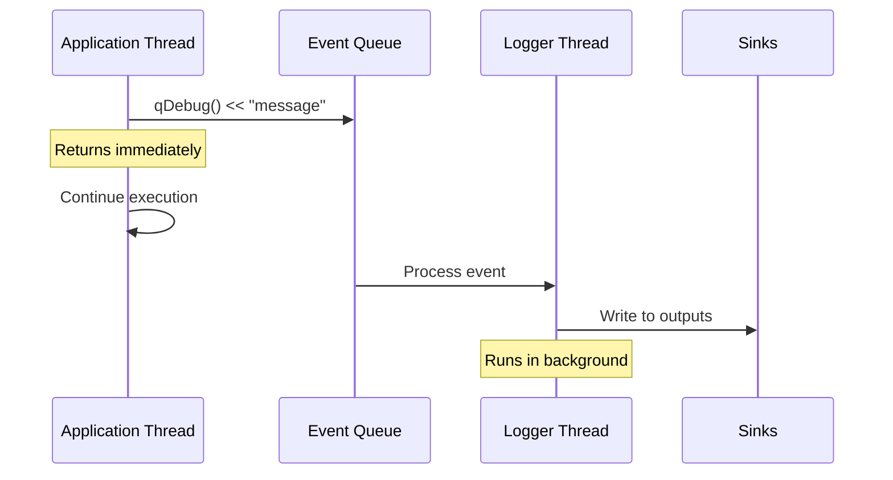

[QtLogger Docs](index.md) > Advanced Usage

# Advanced Usage

This section covers advanced topics including asynchronous logging, thread safety, and creating custom handlers.

---

## Table of Contents

- [Asynchronous Logging](#asynchronous-logging)
  - [How It Works](#how-it-works)
  - [When to Use Async Logging](#when-to-use-async-logging)
  - [Configuration](#configuration)
  - [Graceful Shutdown](#graceful-shutdown)
- [Thread Safety](#thread-safety)
  - [Thread Safety Guarantees](#thread-safety-guarantees)
  - [Thread-Local Context](#thread-local-context)
  - [Best Practices](#best-practices)
- [Creating Custom Handlers](#creating-custom-handlers)
  - [Custom Sink](#custom-sink)
  - [Custom Formatter](#custom-formatter)
  - [Custom Filter](#custom-filter)
  - [Custom Attribute Handler](#custom-attribute-handler)
- [Performance Optimization](#performance-optimization)
- [Integration Patterns](#integration-patterns)

---

## Asynchronous Logging

Asynchronous logging processes log messages in a dedicated background thread, preventing logging operations from blocking your application.

### How It Works



When `moveToOwnThread()` is called:

1. A dedicated `QThread` is created
2. A worker object is moved to that thread
3. Log messages are posted as `QEvent` objects to the worker
4. The worker processes messages sequentially in the background
5. The calling thread returns immediately after posting

### When to Use Async Logging

**Use async logging when:**
- Writing to slow sinks (files, network, databases)
- High-frequency logging would impact performance
- Log operations must not block UI or real-time threads
- Multiple threads log concurrently

**Avoid async logging when:**
- You need immediate log output for debugging
- Application crashes require unflushed logs
- Memory is constrained (events queue in memory)
- Strict message ordering with external events is required

### Configuration

```cpp
#include "qtlogger.h"

int main(int argc, char *argv[])
{
    QCoreApplication app(argc, argv);
    
    // Enable async logging
    gQtLogger
        .moveToOwnThread()  // Must be called before configuration
        .formatPretty()
        .sendToStdErr()
        .sendToFile("app.log", 10*1024*1024, 5);
    
    gQtLogger.installMessageHandler();
    
    // Log calls return immediately
    qDebug() << "This is non-blocking";
    
    return app.exec();
}
```

Via INI file:

```ini
[logger]
async = true
```

### Graceful Shutdown

When the application exits, pending messages are processed before shutdown:

```cpp
// Automatic shutdown handling
// The logger connects to QCoreApplication::aboutToQuit

// Manual control (if needed)
gQtLogger.resetOwnThread();  // Wait for pending messages, then stop thread
```

The shutdown process:
1. Waits for pending messages to be processed
2. Signals the thread to quit
3. Waits up to 3 seconds for graceful termination
4. Force-terminates if necessary

### Checking Async Status

```cpp
if (gQtLogger.ownThreadIsRunning()) {
    qDebug() << "Logger is running asynchronously";
}

QThread *loggerThread = gQtLogger.ownThread();
if (loggerThread) {
    qDebug() << "Logger thread:" << loggerThread;
}
```

---

## Thread Safety

### Thread Safety Guarantees

QtLogger provides the following guarantees:

1. **Concurrent Logging**: Multiple threads can safely call `qDebug()`, `qInfo()`, etc. simultaneously
2. **Internal Protection**: The logger uses a recursive mutex to serialize access
3. **Built-in Handler Safety**: All provided handlers are thread-safe
4. **Atomic Configuration**: Configuration changes are serialized

### Thread ID Tracking

Each `LogMessage` captures its originating thread:

```cpp
// In a handler or formatter
quint64 threadId = lmsg.threadId();
quintptr threadPtr = lmsg.qthreadptr();

// In patterns
gQtLogger.format("[Thread %{threadid}] %{message}");
```

### Thread-Local Context

Use thread-local storage for per-thread context:

```cpp
#include "qtlogger.h"

// Thread-local context
thread_local QString g_requestId;
thread_local QString g_userId;

void setupLogging()
{
    gQtLogger
        .attrHandler([](const QtLogger::LogMessage &) {
            return QVariantHash{
                {"request_id", g_requestId},
                {"user_id", g_userId}
            };
        })
        .format("[%{request_id?}] [%{user_id?}] %{message}")
        .sendToStdErr();
    
    gQtLogger.installMessageHandler();
}

// In request handling code
void handleRequest(const Request &req)
{
    g_requestId = QUuid::createUuid().toString(QUuid::WithoutBraces);
    g_userId = req.userId();
    
    qInfo() << "Processing request";  // Includes context
    // ... handle request ...
    qInfo() << "Request completed";
}
```

### Best Practices

1. **Initialize Early**: Configure the logger before spawning threads

```cpp
int main(int argc, char *argv[])
{
    QCoreApplication app(argc, argv);
    
    // Configure logger FIRST
    gQtLogger.configure();
    
    // Then start worker threads
    startWorkerThreads();
    
    return app.exec();
}
```

2. **Avoid Logging in Destructors**: Global destructors may run after logger shutdown

3. **Use Async for High-Throughput**: Synchronous logging from many threads creates contention

4. **Custom Handler Thread Safety**: If writing custom handlers, ensure they're thread-safe:

```cpp
class ThreadSafeSink : public QtLogger::Sink
{
public:
    void send(const QtLogger::LogMessage &lmsg) override
    {
        QMutexLocker locker(&m_mutex);
        // Thread-safe operations here
        m_buffer.append(lmsg.formattedMessage());
    }

private:
    QMutex m_mutex;
    QStringList m_buffer;
};
```

---

## Creating Custom Handlers

### Custom Sink

A sink outputs log messages to a destination.

```cpp
#include "qtlogger.h"
#include <QSqlDatabase>
#include <QSqlQuery>

class DatabaseSink : public QtLogger::Sink
{
public:
    DatabaseSink(const QString &connectionName)
        : m_connectionName(connectionName)
    {
    }
    
    void send(const QtLogger::LogMessage &lmsg) override
    {
        QSqlDatabase db = QSqlDatabase::database(m_connectionName);
        if (!db.isOpen()) {
            return;
        }
        
        QSqlQuery query(db);
        query.prepare(
            "INSERT INTO logs (timestamp, level, category, message, file, line) "
            "VALUES (?, ?, ?, ?, ?, ?)"
        );
        query.addBindValue(lmsg.time());
        query.addBindValue(QtLogger::qtMsgTypeToString(lmsg.type()));
        query.addBindValue(QString::fromUtf8(lmsg.category()));
        query.addBindValue(lmsg.message());
        query.addBindValue(QString::fromUtf8(lmsg.file()));
        query.addBindValue(lmsg.line());
        query.exec();
    }
    
    bool flush() override
    {
        // Commit any pending transactions
        QSqlDatabase db = QSqlDatabase::database(m_connectionName);
        if (db.isOpen()) {
            db.commit();
        }
        return true;
    }

private:
    QString m_connectionName;
};

// Usage
auto dbSink = QSharedPointer<DatabaseSink>::create("logs_connection");
gQtLogger << dbSink;
```

### Custom Formatter

A formatter converts log messages to strings.

```cpp
#include "qtlogger.h"
#include <QXmlStreamWriter>

class XmlFormatter : public QtLogger::Formatter
{
public:
    QString format(const QtLogger::LogMessage &lmsg) override
    {
        QString output;
        QXmlStreamWriter xml(&output);
        
        xml.writeStartElement("log");
        xml.writeAttribute("level", QtLogger::qtMsgTypeToString(lmsg.type()));
        xml.writeAttribute("time", lmsg.time().toString(Qt::ISODate));
        xml.writeAttribute("category", QString::fromUtf8(lmsg.category()));
        
        xml.writeStartElement("source");
        xml.writeAttribute("file", QString::fromUtf8(lmsg.file()));
        xml.writeAttribute("line", QString::number(lmsg.line()));
        xml.writeAttribute("function", QString::fromUtf8(lmsg.function()));
        xml.writeEndElement();
        
        xml.writeTextElement("message", lmsg.message());
        
        // Include custom attributes
        const auto attrs = lmsg.attributes();
        if (!attrs.isEmpty()) {
            xml.writeStartElement("attributes");
            for (auto it = attrs.begin(); it != attrs.end(); ++it) {
                xml.writeTextElement(it.key(), it.value().toString());
            }
            xml.writeEndElement();
        }
        
        xml.writeEndElement();
        
        return output + "\n";
    }
};

// Usage
auto xmlFormatter = QSharedPointer<XmlFormatter>::create();
gQtLogger << xmlFormatter;
```

### Custom Filter

A filter decides whether messages should continue processing.

```cpp
#include "qtlogger.h"
#include <QElapsedTimer>

// Rate-limiting filter
class RateLimitFilter : public QtLogger::Filter
{
public:
    RateLimitFilter(int maxPerSecond)
        : m_maxPerSecond(maxPerSecond)
        , m_count(0)
    {
        m_timer.start();
    }
    
    bool filter(const QtLogger::LogMessage &lmsg) override
    {
        Q_UNUSED(lmsg)
        
        QMutexLocker locker(&m_mutex);
        
        // Reset counter every second
        if (m_timer.elapsed() >= 1000) {
            m_count = 0;
            m_timer.restart();
        }
        
        // Allow if under limit
        if (m_count < m_maxPerSecond) {
            m_count++;
            return true;
        }
        
        // Log overflow warning once
        if (m_count == m_maxPerSecond) {
            m_count++;
            // Note: Can't log here without risking recursion
        }
        
        return false;
    }

private:
    int m_maxPerSecond;
    int m_count;
    QElapsedTimer m_timer;
    QMutex m_mutex;
};

// Usage
auto rateLimiter = QSharedPointer<RateLimitFilter>::create(100);  // 100 msgs/sec
gQtLogger << rateLimiter;
```

### Custom Attribute Handler

An attribute handler adds metadata to messages.

```cpp
#include "qtlogger.h"
#include <QSysInfo>

class SystemInfoAttr : public QtLogger::AttrHandler
{
public:
    SystemInfoAttr()
    {
        // Capture static info once
        m_staticAttrs = QVariantHash{
            {"os_name", QSysInfo::productType()},
            {"os_version", QSysInfo::productVersion()},
            {"cpu_arch", QSysInfo::currentCpuArchitecture()},
            {"kernel_type", QSysInfo::kernelType()},
            {"kernel_version", QSysInfo::kernelVersion()}
        };
    }
    
    QVariantHash attributes(const QtLogger::LogMessage &lmsg) override
    {
        Q_UNUSED(lmsg)
        
        // Return static info plus dynamic info
        auto attrs = m_staticAttrs;
        
        // Add memory usage (dynamic)
        #ifdef Q_OS_LINUX
        QFile meminfo("/proc/self/statm");
        if (meminfo.open(QIODevice::ReadOnly)) {
            auto parts = meminfo.readAll().split(' ');
            if (parts.size() >= 2) {
                attrs["memory_pages"] = parts[1].toLongLong();
            }
        }
        #endif
        
        return attrs;
    }

private:
    QVariantHash m_staticAttrs;
};

// Usage
auto sysInfo = QSharedPointer<SystemInfoAttr>::create();
gQtLogger << sysInfo;
```

---

## Performance Optimization

### Minimize Formatting Work

```cpp
// Bad: Complex formatting done even if filtered out
gQtLogger
    .format("%{time} [%{type}] %{file}:%{line} %{function} - %{message}")
    .filterLevel(QtWarningMsg)  // Filter AFTER formatting
    .sendToStdErr();

// Good: Filter first, then format
gQtLogger
    .filterLevel(QtWarningMsg)  // Filter FIRST
    .format("%{time} [%{type}] %{message}")  // Simpler format for what passes
    .sendToStdErr();
```

### Use Appropriate Formatters

```cpp
// PrettyFormatter is optimized for console output
gQtLogger
    .formatPretty(true)  // Uses efficient string building
    .sendToStdErr();

// PatternFormatter is flexible but slightly slower
// Use simpler patterns when possible
gQtLogger
    .format("%{time} %{message}")  // Simple pattern
    .sendToFile("app.log");
```

### Batch Network Output

```cpp
// For high-volume network logging, consider batching
class BatchHttpSink : public QtLogger::Sink
{
public:
    void send(const QtLogger::LogMessage &lmsg) override
    {
        QMutexLocker locker(&m_mutex);
        m_buffer.append(lmsg.formattedMessage());
        
        if (m_buffer.size() >= 100) {
            flushBuffer();
        }
    }
    
    bool flush() override
    {
        QMutexLocker locker(&m_mutex);
        return flushBuffer();
    }

private:
    bool flushBuffer()
    {
        if (m_buffer.isEmpty()) return true;
        
        // Send batch to HTTP endpoint
        QJsonArray array;
        for (const auto &msg : m_buffer) {
            array.append(msg);
        }
        // ... send array ...
        
        m_buffer.clear();
        return true;
    }
    
    QStringList m_buffer;
    QMutex m_mutex;
};
```

### Conditional Compilation

```cpp
// Disable debug logging in release builds
#ifdef QT_DEBUG
    gQtLogger
        .format("%{time} [%{type}] %{shortfile}:%{line} %{func}: %{message}")
        .sendToStdErr();
#else
    gQtLogger
        .filterLevel(QtInfoMsg)
        .format("%{time} [%{type}] %{message}")
        .sendToFile("app.log");
#endif
```

---

## Integration Patterns

### Log to Multiple Destinations

```cpp
gQtLogger
    .moveToOwnThread()
    .addSeqNumber()
    
    // Development console
    .pipeline()
        .formatPretty(true)
        .sendToStdErr()
    .end()
    
    // Application log file
    .pipeline()
        .format("%{time yyyy-MM-dd hh:mm:ss.zzz} [%{type:>8}] [%{category}] %{message}")
        .sendToFile("app.log", 50*1024*1024, 10,
                    QtLogger::RotatingFileSink::RotationDaily
                    | QtLogger::RotatingFileSink::Compression)
    .end()
    
    // Error-only log
    .pipeline()
        .filterLevel(QtCriticalMsg)
        .format("%{time} %{file}:%{line}\n%{function}\n%{message}\n")
        .sendToFile("errors.log")
    .end()
    
    // Centralized logging
    .pipeline()
        .addAppInfo()
        .addHostInfo()
        .formatToJson(true)
        .sendToHttp("https://logs.example.com/ingest")
    .end();

gQtLogger.installMessageHandler();
```

### Integration with Qt GUI

```cpp
#include "qtlogger.h"
#include <QPlainTextEdit>

class LogWidget : public QPlainTextEdit
{
    Q_OBJECT
    
public:
    LogWidget(QWidget *parent = nullptr) : QPlainTextEdit(parent)
    {
        setReadOnly(true);
        setMaximumBlockCount(1000);  // Limit memory usage
    }
    
public slots:
    void appendLog(const QtLogger::LogMessage &lmsg)
    {
        // Must be called from GUI thread
        QString color;
        switch (lmsg.type()) {
        case QtDebugMsg: color = "gray"; break;
        case QtInfoMsg: color = "black"; break;
        case QtWarningMsg: color = "orange"; break;
        case QtCriticalMsg: color = "red"; break;
        case QtFatalMsg: color = "darkred"; break;
        }
        
        appendHtml(QString("<span style='color:%1'>%2</span>")
            .arg(color, lmsg.formattedMessage().toHtmlEscaped()));
    }
};

// Setup
LogWidget *logWidget = new LogWidget;

gQtLogger
    .formatPretty()
    .sendToSignal(logWidget, SLOT(appendLog(QtLogger::LogMessage)));

gQtLogger.installMessageHandler();
```

### Integration with Testing

```cpp
#include "qtlogger.h"
#include <QTest>

class LogCapture
{
public:
    LogCapture()
    {
        m_sink = QSharedPointer<QtLogger::SignalSink>::create();
        QObject::connect(m_sink.data(), &QtLogger::SignalSink::message,
                        [this](const QtLogger::LogMessage &lmsg) {
            m_messages.append(lmsg);
        });
        
        gQtLogger << m_sink;
        gQtLogger.installMessageHandler();
    }
    
    ~LogCapture()
    {
        gQtLogger.restorePreviousMessageHandler();
    }
    
    bool hasMessage(const QString &text) const
    {
        for (const auto &msg : m_messages) {
            if (msg.message().contains(text)) {
                return true;
            }
        }
        return false;
    }
    
    int countLevel(QtMsgType type) const
    {
        int count = 0;
        for (const auto &msg : m_messages) {
            if (msg.type() == type) count++;
        }
        return count;
    }
    
    void clear() { m_messages.clear(); }

private:
    QtLogger::SignalSinkPtr m_sink;
    QList<QtLogger::LogMessage> m_messages;
};

// In tests
void MyTest::testLogging()
{
    LogCapture capture;
    
    myFunction();  // Function that logs
    
    QVERIFY(capture.hasMessage("Operation completed"));
    QCOMPARE(capture.countLevel(QtWarningMsg), 0);
}
```

---

## Navigation

| Previous | Next |
|----------|------|
| [← Attribute Handlers](api/attributes.md) | [Index →](index.md) |